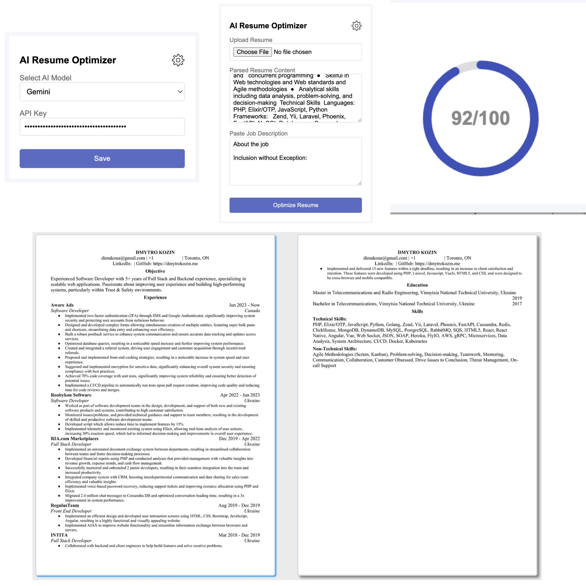

# 💼 Job Match Resume Analyzer (SaaS)

This project started as a Chrome extension but now ships as a standalone web application that lets candidates upload a resume, paste any job description, and receive an AI-optimized resume plus an ATS compatibility score.



## ✨ Key Capabilities

* **Unified web experience:** Upload resumes, paste job descriptions, and run optimization from any browser.
* **Multi-provider AI:** Support for Gemini, GPT, and Claude (either via environment tokens or your personal API keys).
* **Document parsing + export:** PDF, DOCX, and text parsing are powered by the existing browser-side libraries, and optimized resumes are exported directly as DOCX files.
* **Live ATS score + explanation:** A circular progress indicator and narrative explain why the resume matches the job description.
* **Settings persistence:** AI model selection and API keys are stored in the browser via `localStorage`.

## 🚀 Quick Start

1. **Install dependencies.**

   ```bash
   npm install
   ```

2. **Configure your AI tokens.**
   * Optionally create a `.env` file from `.env.example` if you want the server to reuse static tokens.
   * You can also paste your keys directly inside the "AI Settings" modal at runtime.

3. **Run the application.**

   ```bash
   npm start
   ```

   Open [http://localhost:4000](http://localhost:4000) in your browser.

4. **Optional:** use `npm run dev` during development to restart the server on save (requires `nodemon`).

## 🔐 Environment Variables

 | Variable | Description |
 | --- | --- |
 | `PORT` | Port the Express server listens on (default: `4000`). |
 | `GEMINI_API_KEY` | Optional default key for the Gemini model. |
 | `OPENAI_API_KEY` | Optional default key for OpenAI/GPT. |
 | `ANTHROPIC_API_KEY` | Optional default key for Claude. |

If a key is provided in the UI, it overrides the matching environment variable for that request.

## 💻 How to Use

1. Upload your resume (PDF, DOCX, or plain text).
2. Paste the job description you are targeting.
3. Open "AI Settings" to choose a model and provide an API token (or rely on the server-provided keys).
4. Click **Optimize Resume**.
5. Download the optimized DOCX file and review the generated ATS score/explanation.

## 📦 Supported Files

* PDF (.pdf) via `pdf.js`
* Microsoft Word (.docx) via Mammoth.js
* Plain text (.txt)

## 🔁 Legacy Extension Assets

The repository still contains the original Chrome extension files (`manifest.json`, `popup.html`, etc.) for reference, but the main entry point is now `server.js` + the `public/` UI.

## 🤝 Contributing

1. Fork the repo and create a feature branch.
2. Run tests or `npm run lint` if available.
3. Submit a pull request and describe the new web experience you built.

## 📜 License

This project remains under the [MIT License](LICENSE).
